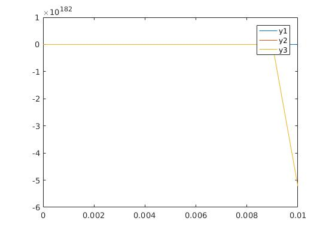
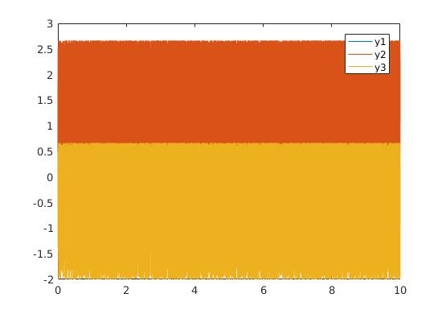
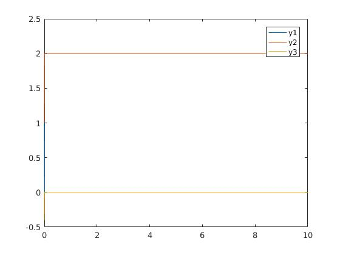
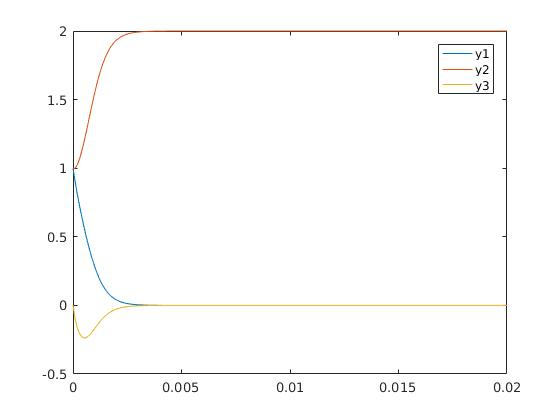
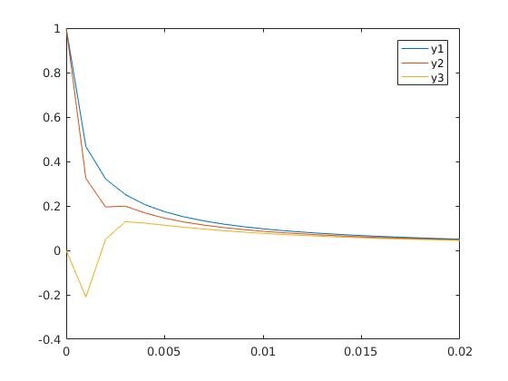
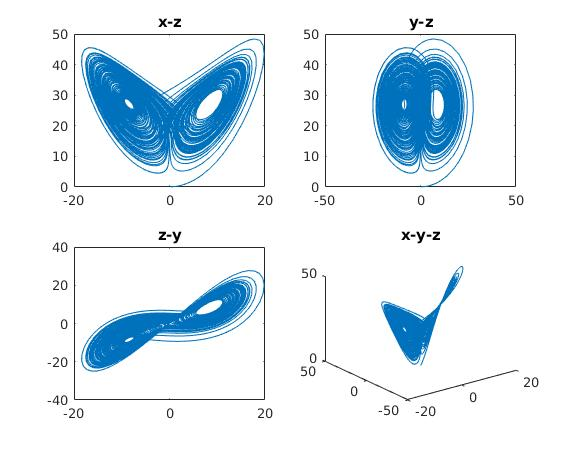
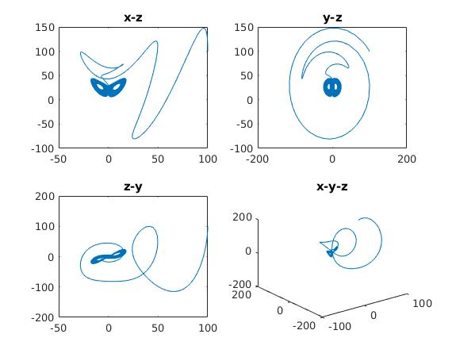
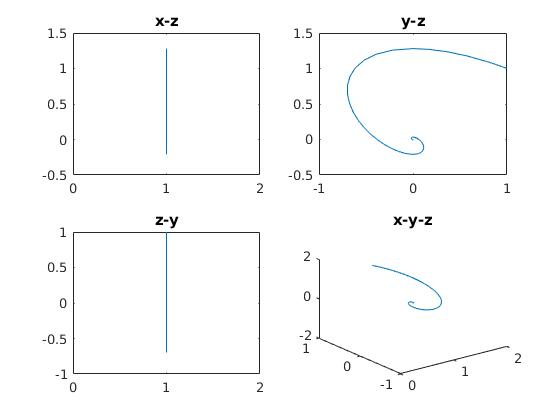
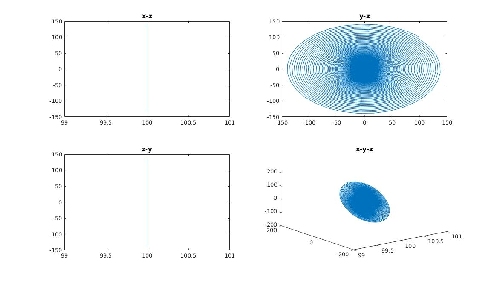
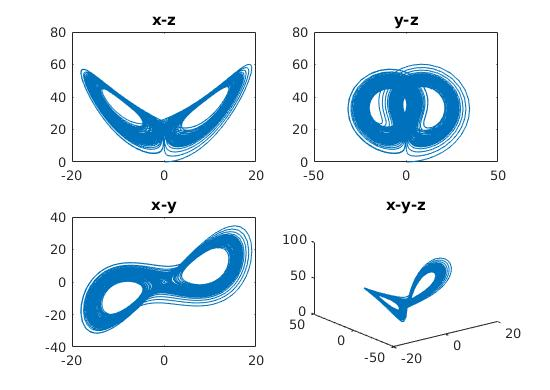

# Numerical Math HW10

## Problem 1

- 先尝试用最简单的显式单步Euler方法进行求解，实验所得情况如下：

  - h=0.001

    

  - h=0.0006

    

  - h=0.0004

    

  - 可进行放大，具体观察三条曲线的收敛过程：

    h=0.0001:

    

  - 因此，得到结论，Euler方法使得问题稳定的步长大致为0.0004。

- 改进Euler方法

  - h=0.0001	所得出的图像与上张区别微小，收敛速度无大变化。

- 4阶显式runge-kutta

  - h=0.001  这一方法较最初的Euler方法，最大的优点是收敛步长变大，h取0.001也可收敛，收敛的速度未有明显变化，值得一提的是，它收敛到了一个与此前方法稍有不同的解，y2的值有所不同。

  

- 总结，在此问题中，所得收敛解y1,y3均为0，但y2不存在限制，可以取任意值，实际求解中，y2的最终值往往与方法有关，另外，高阶的方法往往有着更大的收敛步长。

## Problem2

### (1)

- 固定参数，对于不同初值的实验结果如下：

  - (0.1,0.1,0.1)	 曲线未发散，但无法看出周期性或趋于某点的迹象。

    

  - (100,100,100)   曲线收敛到上图混沌区域的范围

    

    ​

  - 尝试其他值，最终都会收敛至这一区域形成混沌的状态。

### (2)

- 举几例：

  - 参数全为0时，x不变，初值取(1,1,1)时，曲线收敛到(0,0,0):

    

  - 初值取(100,100,100)时，以有趣的螺旋形态收敛：

    `

  - 参数取(-5,35,-8/3)，混沌，形态稍有变化

    ​

