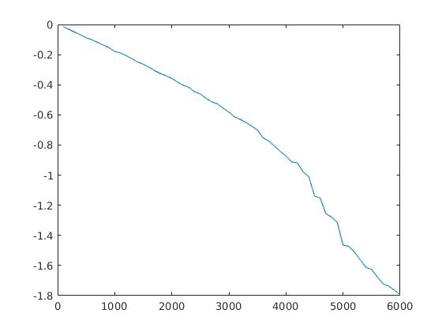
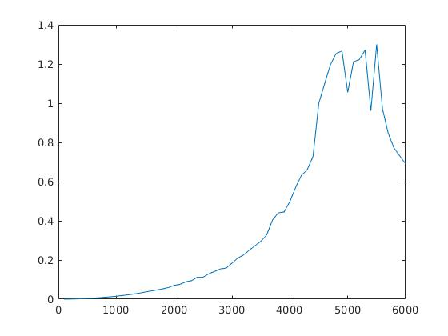

# Numerical Math HW12

### 段浩东 1500017705

## 上机习题7.4

### 题目

考察$M×M$格点二维Ising模型中$U_m,C_m$随温度变化的相变现象，并数值确定相变的临界温度$\beta_c$。这里J取为1,边界条件取为周期。

### 解答

首先列出定义式：

### $U_M=\frac{1}{M}\sum_{\sigma}\frac{exp(-\beta H(\sigma))}{Z_M}H(\sigma)$

### $C_M=\frac{\beta^2}{M}\{\sum_{\sigma}H^2(\sigma)\frac{exp(-\beta H(\sigma))}{Z_M}-[\sum_{\sigma}H(\sigma)\frac{exp(-\beta H(\sigma))}{Z_M}]^2\}$

### $H(\sigma) = -J\sum_{<p_1p_2>}\sigma_{p_1}\sigma_{p_2}$

### $\beta=(k_BT)^{-1}$

使用Metropolis算法求解本题：

1. 随机生成预选状态$\sigma^{(1)}$
2. 循环：
   1. 对状态$\sigma^{(i)}$，随机改变其中一个格点，生成预选态$\sigma'$
   2. 定义$\Delta H(\sigma)=H(\sigma')-H(sigma^{(i)})$，令$A=min\{1,exp\{-\beta \Delta H(\sigma)\}\}$
   3. 生成一均匀分布随机数r，满足分布$U[0,1]$
   4. 若r<=A，则$\sigma^{(i+1)}=\sigma'$，否则$\sigma^{(i+1)}=\sigma^{i}$
3. 对这一$\sigma$序列求平均代替$\sum_{\sigma}$

为节省计算资源，本题在$10*10$网格上进行模拟，边界取为周期，每一次的求解使用200000个状态进行平均。

查表知常数：kT=0.025852eV  (T=300K时) (课本对玻尔兹曼常数单位描述不清，应是这一个)

计算所得结果：

U与T的函数：

C与T的函数：

可以看出，U的函数随T逐步下降，表示随着温度的升高，物质的内能逐渐增大，导致内部格点的自旋趋于混乱。因此U减小。而C随T的变化有一个很有趣的现象：在约4500K——5500K处存在一平台期，C值达到最大，在平台期以外，C先增大后减小。