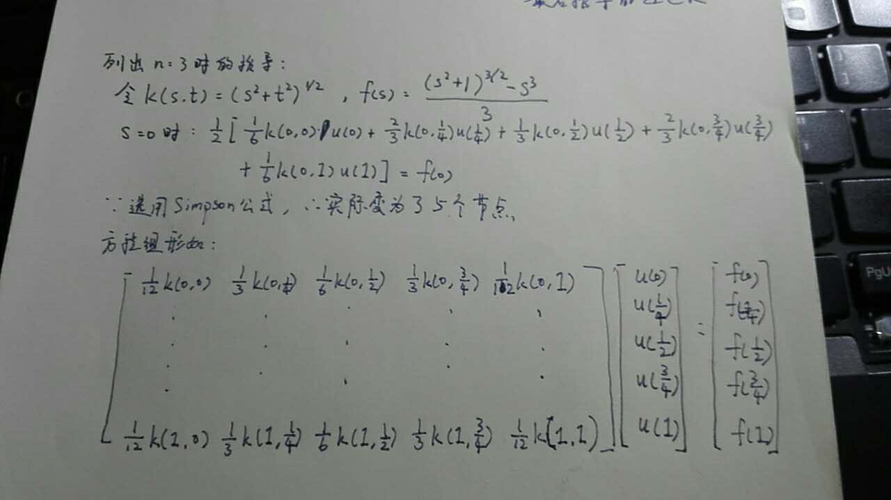
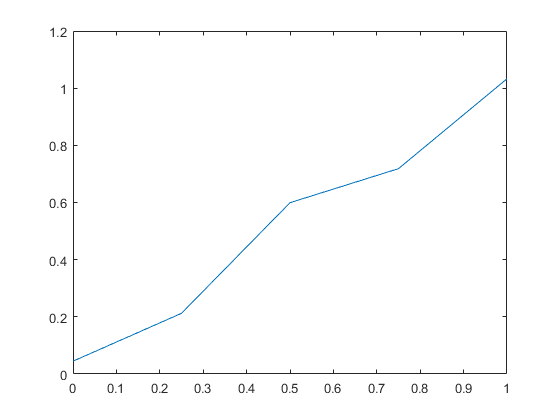
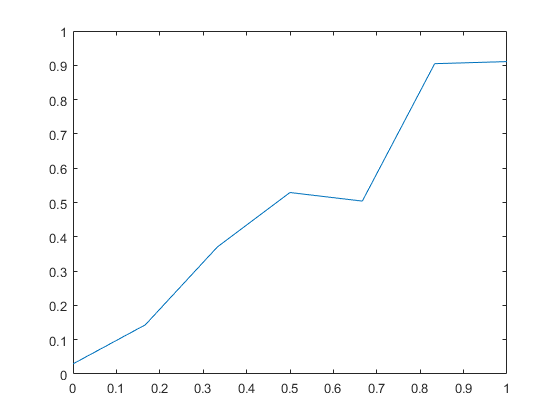
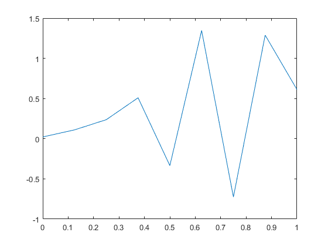

#Numerical Math HW5
###By 段浩东 1500017705
##8.3
- 节点与权数数值来源：http://www.pitt.edu/~dejong/dbook/code/gauss_hermite.txt
- 计算结果

----------

	N=3	    Value=1.38203307138804665222	Error=0.00164462434490375564
	N=4	    Value=1.38032975716125538845	Error=-0.00005868988188750812
	N=5 	Value=1.38039007593565621335	Error=0.00000162889251331677
	N=6	    Value=1.38038841005073376067	Error=-0.00000003699240913591
	N=7	    Value=1.38038844775407842924	Error=0.00000000071093553267
	N=8	    Value=1.38038844703130036962	Error=-0.00000000001184252696
	N=9	    Value=1.38038844704331653546	Error=0.00000000000017363888
	N=10	Value=1.38038844704314134226	Error=-0.00000000000000155431
	N=11	Value=1.38038844704314422884	Error=0.00000000000000133227
	N=12	Value=1.38038844704314400680	Error=0.00000000000000111022
	N=13	Value=1.38038844704314311862	Error=0.00000000000000022204
	N=14	Value=1.38038844704314334066	Error=0.00000000000000044409
	N=15	Value=1.38038844704314267453	Error=-0.00000000000000022204
	N=16	Value=1.38038844704314445089	Error=0.00000000000000155431
	N=17	Value=1.38038844704314311862	Error=0.00000000000000022204
	N=18	Value=1.38038844704314223044	Error=-0.00000000000000066613
	N=19	Value=1.38038844704314356271	Error=0.00000000000000066613
	N=20	Value=1.38038844704314178635	Error=-0.00000000000000111022
- 计算代码
#
	#include<iostream>
	#include<cstdio>
	#include<cmath>
	using namespace std;
	char s[250];int i=3;
	int main(){
		freopen("node&weight.txt","r",stdin);
		freopen("out.txt","w",stdout);
		gets(s);gets(s);
		double trueval=sqrt(acos(-1))*exp(-0.25);
		for(int i=3;i<=20;i++){
			gets(s);
			double ans=0;
			for(int j=1;j<=i;j++){
				double node,w;
				cin>>node>>w;
				ans+=w*cos(node);
			}
			gets(s);gets(s);
			printf("N=%d\tValue=%.20lf\tError=%.20lf\n",i,ans,ans-trueval);
		}
	} 
##11
- 推导
#

- 计算代码
#
	% k函数与f函数如推导过程所定义
	% 函数最终画出一图像，即解得的离散点连接为分段线性函数
	function []=ex11(m)
	mat_k = zeros(2*m-1);
	for i = 1:(2*m-1)
	    for j = 1:(2*m-1)
	        mat_k(i,j) = k((i-1)/(2*m-2),(j-1)/(2*m-2));
	        if mod(j,2) == 0
	            mat_k(i,j) = mat_k(i,j)*2/3;
	        else
	            if j==1 | j==(2*m-1)
	                mat_k(i,j) = mat_k(i,j)/6;
	            else
	                mat_k(i,j) = mat_k(i,j)/3;
	            end
	        end
	    end
	end
	mat_k = mat_k.*(1/(m-1));
	cond(mat_k)
	vec_f = zeros(2*m-1,1);
	for i = 1:2*m-1
	    vec_f(i) = f((i-1)/(2*m-2));
	end
	vec_u = pinv(mat_k)*vec_f;
	vec_x = 0:1/(2*m-2):1;
	plot(vec_x,vec_u);
- 经计算发现，n=3时求得的效果最好，猜测可能是因为n较大时矩阵的条件数过大，影响了求解的准确度：
## 部分图像：
#### n=3

#### n=4

#### n=5

# 
- N与条件数
#
	N=3 cond=1.8334e+04
	N=4 cond=3.3103e+06
	N=5 cond=5.3249e+08
	N=6 cond=8.1512e+10
	N=7 cond=1.2158e+13
- 条件数与n约为一指数函数的关系