#Numerical Math HW5
###By 段浩东 1500017705
##1
###(1)
- 易知f(x)仅在[-1,1]上有零点，又因为f为奇函数，所以仅考虑(0,1]上，由sin(10x)周期性，知(0,0.2&times;pi]上有一个零点，(0.2&times;pi,1]上有两个零点，再加上0，总共有7个零点。
- 下图画出y=sin(10x)与y=x，两函数相交点即为零点
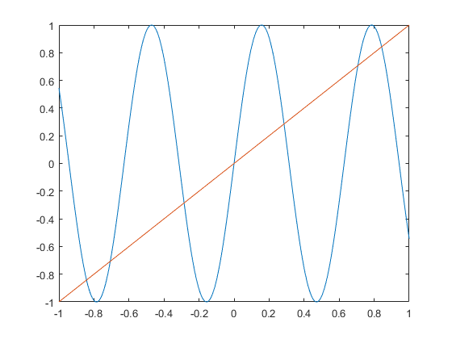

----------

###(2)
- 由对称性，仅列出非负根：
	- x0 = 0
	- x1 = 0.285234
	- x2 = 0.706817
	- x3 = 0.842320
- 我分别选用了二分法和不动点法进行计算：
	- 其中二分法需要先大致通过估计得到每一个零点临近的两点，函数值分别为一正一负，而后进行二分，此问题中所求解的函数比较正常，因此迭代停止条件正常选取即可，我选取了|f(x)|<1e-8这一条件
	- 不动点法我选择的函数是x=arcsin(x)/10，右侧函数的导数值为1/(10*sqrt(1-x^2))，这一值在x属于[-0.99,0.99]时绝对值小于1。而这一区间又包含了所有的根。因此迭代时初值选取接近所希望求的根的位置，使用不动点法即可求得所有根。

----------

##2
- 推导如下 
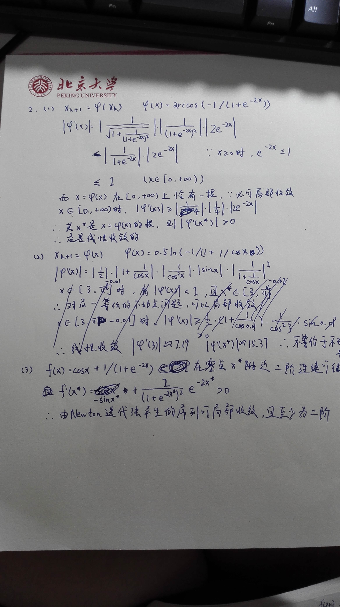

----------
- code in ex2.m

----------

### error of way1
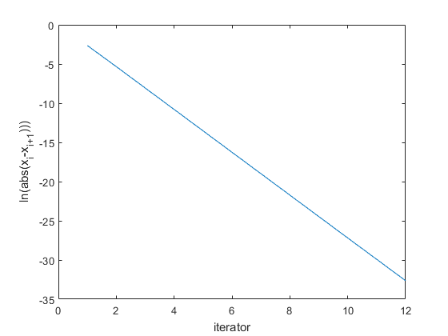

----------
### error of way3
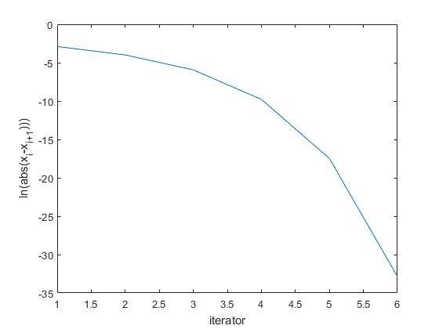

----------
##3
- 实现代码分别为ex3___1.m与ex3_2.m
- Newton方法大约需要4次迭代即可达到机器精度 
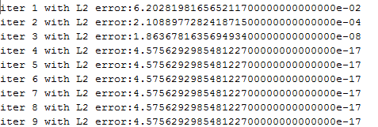
- 但在试验中，Broyden方法约9次迭代左右达到机器精度 
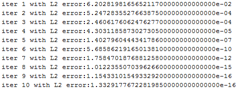
- 在此以后，Broyden迭代输出NaN，经考察后发现，是由于A-1经迭代运算变为NaN所致 
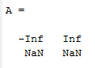
----------

##4
- 利用不动点法，选取初值(1,1,1)T，解得此方程的解为(0,1/3,0)T，考察收敛速度：
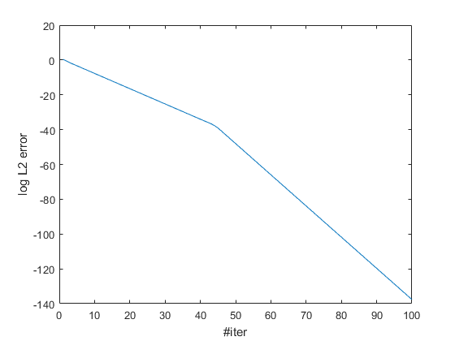
- 不动点处的Jacobi矩阵为 
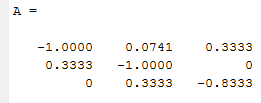
- 即若误差原为(x,y,z)T，一步以后变为(-2x/3,-16y/27,-z/2)T
- 实际观测到的常数C约为0.4
- 使用Newton迭代法获得的结果如下：
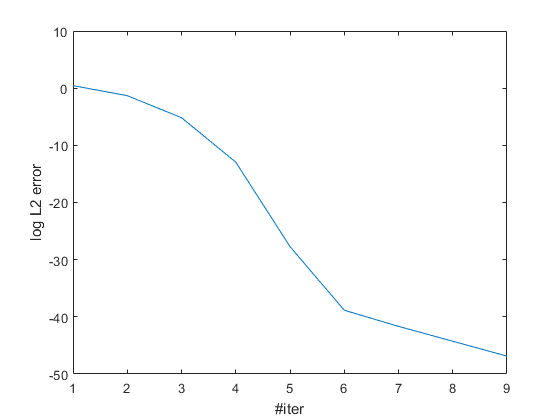
- 对比发现，不动点法需50多次迭代才可收敛，而牛顿法仅需6次左右，且很容易观察出一为线性收敛，另一为2阶收敛。
-------
##5
###5_2
- 利用牛顿法，所得到的误差与迭代次数关系如下： 
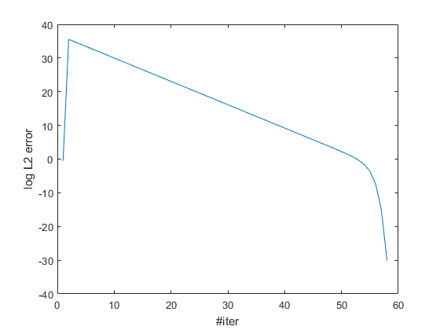
- 开始阶段误差暴增，是由于初值处Jacobi矩阵奇异的缘故，而且由此看出，仅有迭代的x接近0点时，才体现出二阶

###5_5
- 利用牛顿法，解得方程的根为x1=0.0000109816;x2=9.1061467399;
- 误差曲线如下: 
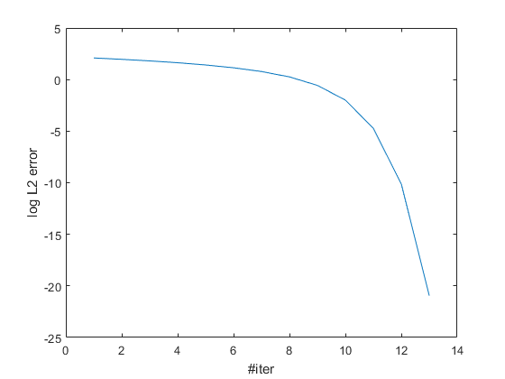