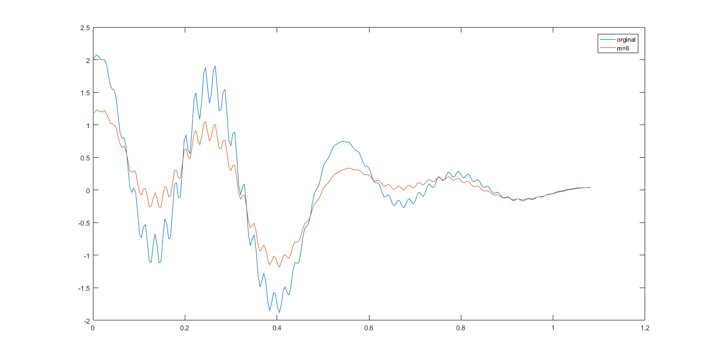
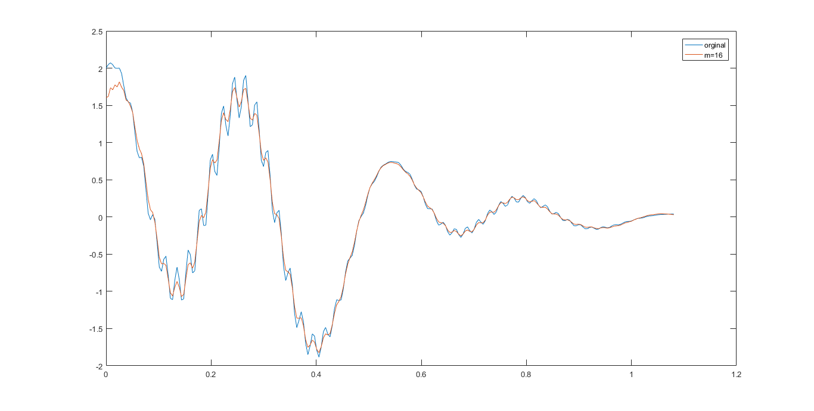
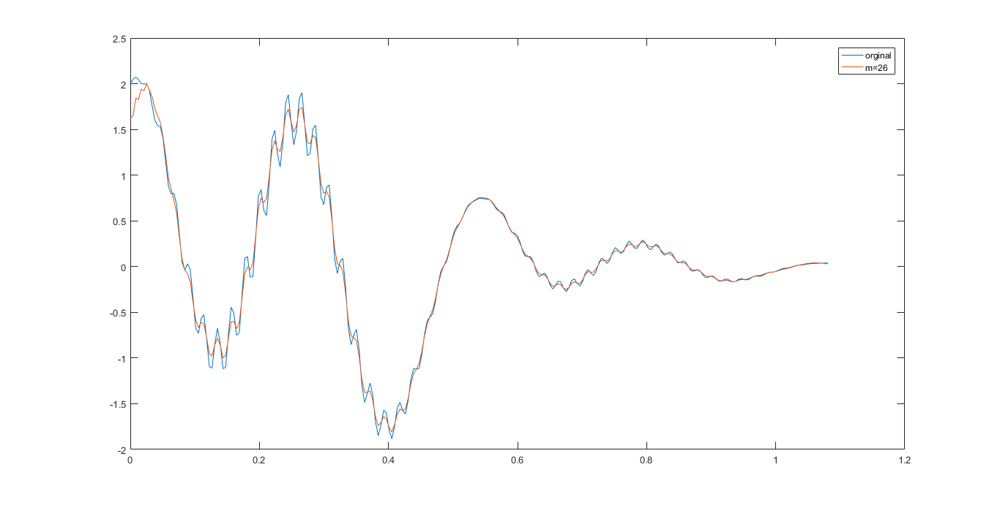

#Numerical Math HW7
###By duanhaodong 1500017705
##The implementation of FFT
	// a complex class implementation
	struct complex{
	   double r,i;
	   complex(double r,double i=0):r(r),i(i){}
	   complex():r(0),i(0){}
	   friend complex operator + (const complex& a,const  complex& b){
	          return complex(a.r+b.r,a.i+b.i);
	   }
	   friend complex operator - (const complex& a,const  complex& b){
	          return complex(a.r-b.r,a.i-b.i);
	   }
	   friend complex operator * (const complex& a,const  complex& b){
	          return complex(a.r*b.r-a.i*b.i,a.r*b.i+a.i*b.r);
	   }
	   friend complex operator / (const complex& a,double b){
	          return complex(a.r/b,a.i/b);
	   }
	}
	// reverse a binary number of length cnt
	int reverse(int x){
	    int ans=0;
	    rep(i,1,cnt){
	        ans*=2;
	        ans+=x%2;
	        x/=2;
	    }
	    return ans;
	}
	// flag = 1: DFT flag = -1: inv-DFT , input is in reversed order
	void FFT(complex* X,double flag){
	    rep(i,0,cnt-1){
	        for(int j=0;j<pow2[cnt];j+=pow2[i+1]){
	            complex theta=complex(1.0);
	            complex delta=complex(cos(flag*pi/pow2[i]),sin(flag*pi/pow2[i]));
	            for(int k=1;k<=pow2[i];k++){
	                complex a=X[j+k-1];
	                complex b=X[j+k-1+pow2[i]];
	                X[j+k-1]=a+theta*b;
	                X[j+k+pow2[i]-1]=a-theta*b;
	                theta=theta*delta;
	            }
	        }
	    }
	    if(flag<0){
	        rep(i,0,pow2[cnt]-1)
	        X[i]=X[i]/pow2[cnt];
	    }
	}
 
------------
##2
- the implementation of this problem is in fft1.cpp
- the result of FFT method and traditional method are stored in fft2_1.txt & fft2_2.txt, and they are absolutely the same
- the time cost of FFT method is 4ms , traditional method is 47ms.
 

##3
- the implementation of this problem is in fft3.cpp
- the figure of different m:
- m=6
 

- m=16
 

- m=26
 

- if m is larger, the inv-DFT can fit the original curve better.
