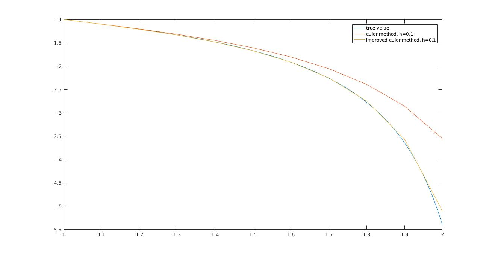

#Numerical Math HW9
###Haodong Duan 1500017705
- It's obvious that f(x,y) satisfy Lipschitz condition, so that as h->0 ,error would be smaller. In this problem we use the solution with Euler method when h = 10^-5 to approximate the true value

- we found that the result of improved euler method is much better than the pure euler method. And the computation need to be done is just the twice. The Adam method can get a better solution than Improved Euler method, but needs a bunch of computation (a large number of equations need to be solved).